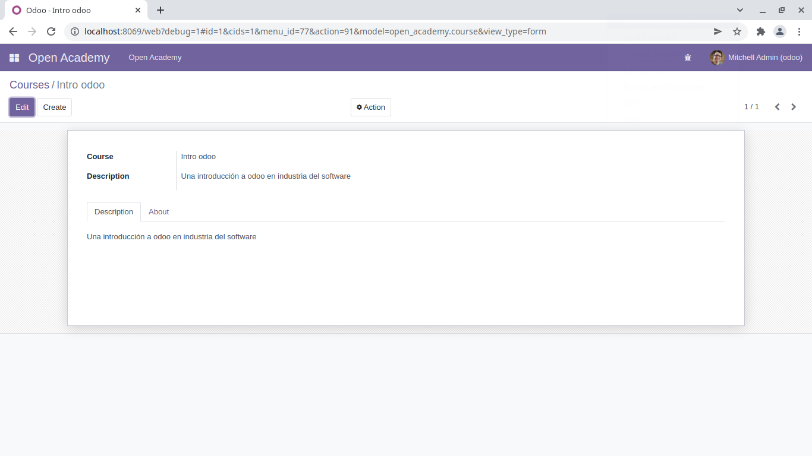

# Construcción de un módulo en odoo
---

Odoo proporciona un mecanismo para ayudar a configurar un nuevo módulo:

    odoo-bin scaffold <Nombre del módulo> <Ruta donde se creara el módulo>

## Ejercicio 1: Creación de módulos
`    Use la línea de comando anterior para crear un módulo Open Academy vacío e instálelo en Odoo.`

  - Creación del esqueleto:
  
    
    

## Ejercicio 2: Definir un módulo
`    Defina un nuevo modelo de datos Curso en el módulo de openacademy . Un curso tiene un título y una descripción. Los cursos deben tener un título`.

  - Definiendo un módulo 'Curse'
  
    

  - Visualización del módulo creado
    
  

## Ejercicio 3: Definir datos de demostración
    
`Cree datos de demostración llenando el modelo de Cursos con algunos cursos de demostración.`

  - Creando y definiendo un vista para crear datos de demostración con el modelo de cursos:
  
  

## Ejercicio 4: Definir nuevas entradas de menú

`Defina nuevas entradas de menú para acceder a los cursos en la entrada de menú de OpenAcademy. Un usuario debe ser capaz de:`
  - Mostrar una lista de todos los cursos
  - Crear/Modificar cursos

  Definiendo una acción en el archivo `open_academy/views/open_academy_menu.xml`

  

  Creando un archivo `open_academy/views/open_academy_menu.xml` con los ménus para activar las acciones definidas.

  

  Agregando el nuevo archivo al `__manifest__.py`

  
  
1. Mostrando la lista con todos los cursos:
  

2. Creando un curso:
  
3. Editando un curso
  
  
  

## Ejercicio 5: Personalizar la vista del formulario usando XML
`Cree su propia vista de formulario para el objeto Curso. Los datos mostrados deben ser: el nombre y la descripción del curso.`

  
  

## Ejercicio 6: Notebooks
`En la vista de formulario del curso, coloque el campo de descripción debajo de una pestaña, de modo que sea más fácil agregar otras pestañas más adelante, que contengan información adicional.`

  
  
## Ejercicio 7: Buscar Cursos
`Permitir la búsqueda de cursos en función de su título o su descripción.`
  

## Ejercicio 8: Crear un modelo de sesión
`Para el módulo Open Academy, consideramos un modelo para sesiones : una sesión es una ocurrencia de un curso impartido en un momento dado para una audiencia determinada.`

`Crear un modelo para las sesiones . Una sesión tiene un nombre, una fecha de inicio, una duración y un número de asientos. Agregue una acción y un elemento de menú para mostrarlos. Haga que el nuevo modelo sea visible a través de un elemento de menú.`

- Resultado: 
  
  

## Ejercicio 9: Relaciones muchos a uno
`Usando many2one, modifique los modelos Course y Session para reflejar su relación con otros modelos:`
- Un curso tiene un usuario responsable ; el valor de ese campo es un registro del modelo incorporado res.users.

- Una sesión tiene un instructor ; el valor de ese campo es un registro del modelo incorporado res.partner.

- Una sesión está relacionada con un curso ; el valor de ese campo es un registro del modelo openacademy.coursey es obligatorio.

- Adaptar las vistas.

Resultado:
  
  

# Ejercicio 10: Relaciones inversas uno a muchos
`Usando el campo relacional inverso one2many, modifique los modelos para reflejar la relación entre cursos y sesiones.`

Resultado: 
  

# Ejercicio 11: Relaciones Many2Many múltiples
  Utilizando el campo relacional Many2Many, modifica el modelo de Session para relacionar cada sesión a un conjunto de asistentes (attendees). Los asistentes estarán representados por los registros partners, por lo que se relacionan con el modelo res.partner. Adapta las vistas en consecuencia.

Resultado:
  

# Ejercicio 12: Alterar el contenido existente
- Usando la herencia del modelo, modifique el modelo de socio existente para agregar un instructorcampo booleano y un campo many2many que corresponda a la relación sesión-socio

- Usando la herencia de vista, muestre estos campos en la vista de formulario de socio

Resultado:
  

# Ejercicio 13: Dominios en campos relacionales

Al seleccionar el instructor para una sesión , solo deben estar visibles los instructores (socios con el valor instructor establecido en ).True deben ser visibles 

Resultado:
  

# Ejercicio 14: Dominios más complejos

Crear nuevas categorías de socios Profesor / Nivel 1 y Profesor / Nivel 2 . El instructor de una sesión puede ser un instructor o un profesor (de cualquier nivel).

Resultado:
  
  
  

# Ejercicio 15: Campos calculados

- Agregue el porcentaje de asientos ocupados al modelo de sesión

- Mostrar ese campo en las vistas de árbol y formulario

- Mostrar el campo como una barra de progreso

Resultado:
  

# Ejercicio 16: Objetos activos: valores predeterminados

- Defina el valor predeterminado de start_date como hoy (ver Date).

- Agregue un campo activeen la clase Sesión y configure las sesiones como activas de forma predeterminada.
  

# Ejercicio 17: Advertencia

- Agregue un onchange explícito para advertir sobre valores no válidos, como un número negativo de asientos o más participantes que asientos.

Resultado:
  
  

# Ejercicio 18: Agregar restricciones de Python

 - Agregue una restricción que verifique que el instructor no esté presente en los asistentes de su propia sesión.

Resultado:
  

# Ejercicio 19: Agregar restricciones de SQL

Con la ayuda de la documentación de PostgreSQL , agregue las siguientes restricciones:

- VERIFIQUE que la descripción del curso y el título del curso sean diferentes

- Haz que el nombre del curso sea ÚNICO

Resultado: 
  
  

# Ejercicio 20: Ejercicio 6: agregar una opción duplicada

Dado que agregamos una restricción para la unicidad del nombre del curso, ya no es posible usar la función «duplicar» ( Formulario ‣ Duplicar ).

Vuelva a implementar su propio método de «copia» que permite duplicar el objeto del curso, cambiando el nombre original a «Copia de [nombre original]».

Resultado:
  

# Ejercicio 21: Lista para colorear

Modifique la vista de árbol de sesión de tal manera que las sesiones que duren menos de 5 días se coloreen de azul y las que duren más de 15 días se coloreen de rojo.

Resultado:
  
  

# Ejercicio 22: Vista de calendario

Agregue una vista de calendario al modelo de sesión que permita al usuario ver los eventos asociados a Open Academy.
Resultado: 
  

# Ejercicio 23: Vistas de búsqueda

- Agregue un botón para filtrar los cursos de los que el usuario actual es responsable en la vista de búsqueda de cursos. Hágalo seleccionado por defecto.

- Agregue un botón para agrupar cursos por usuario responsable.
  Resultado:
  

# Ejercicio 24: diagramas de Gantt

Agregue un diagrama de Gantt que le permita al usuario ver la programación de sesiones vinculada al módulo Open Academy. Las sesiones deben agruparse por instructor.

Resultado:

      La vista de Gantt requiere el módulo web_gantt que está presente en la versión de edición empresarial .

# Ejercicio 25: Vistas en Gráfico

- Agrega una vista de gráfico en el objeto Session que muestre, para cada curso, el número de participantes bajo la forma de un gráfico de barras.

- Agrega el número de asistentes como un campo calculado almacenado

- Luego añade la vista relevante
  
Resultado:

